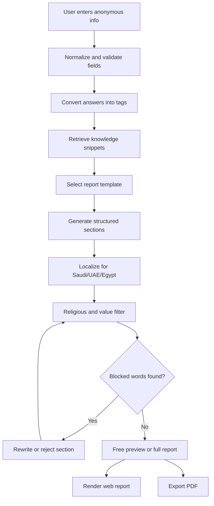

# 中东 AI 心理成长报告独立站执行规格书

版本：MVP v2  
日期：2026-06-29  
目标市场：沙特、阿联酋、埃及  
产品形态：纯 AI 自动生成网页版/PDF 电子报告，无真人咨询、无社群、无直播  
网站角色：社媒流量承接 + 付费转化终端  
核心目标：专业精准感、短路径转化、强隐私信任、本土审美适配

> 统一口径：本产品是自我认知与心理疏导工具。所有内容基于心理学、符号学理论体系与结构化素材库分析，仅供成长决策参考，不构成宗教指引、医疗诊断、心理治疗或法律建议。

---

## 1. 产品定位与上线策略

### 1.1 对外定位

English:
Private AI self-insight reports for personality, emotions, relationships, work strengths, and symbolic reflection.

Arabic:
تقارير ذكية خاصة لفهم الذات والمشاعر والعلاقات ونقاط القوة والتأمل الرمزي.

中文内部：
面向中东年轻女性和城市白领的匿名 AI 自我认知报告站。用户从 TikTok、Instagram、Snapchat、WhatsApp 等渠道点击进入对应报告落地页，填写少量匿名信息，立即获得免费简版报告，再通过单份报告或会员解锁完整报告。

### 1.2 首发产品

优先上线 4 款低风险/高转化产品：

| 优先级 | 产品 | 对外名称 | 风险 | 商业作用 |
|---|---|---|---|---|
| P0 | 性格天赋 | Hidden Personality Map | 低 | 拉新主产品 |
| P0 | 亲密关系 | Relationship Pattern Report | 中低 | 女性用户强痛点 |
| P0 | 情绪状态 | Emotional Load Check-in | 低 | 社媒投放转化强 |
| P0 | 职业优势 | Work Strengths Profile | 低 | 付费理由明确 |

后置 2 款中风险产品：

| 优先级 | 产品 | 对外名称 | 风险 | 上线条件 |
|---|---|---|---|---|
| P1 | 潜意识卡牌 | Symbolic Reflection Cards | 中 | 完成词库过滤与人工抽检 |
| P1 | 梦境心理映射 | Dream Journal Reflection | 中 | 明确非宗教、非预言边界 |

### 1.3 禁止对外产品名

公开页面、广告、报告标题、支付页不得使用以下作为产品名：

- fortune reading
- tarot reading
- horoscope
- astrology prediction
- destiny analysis
- future forecast
- 运势
- 塔罗
- 星盘
- 算命
- 占卜

内部可用映射：

| 内部概念 | 对外合规表达 |
|---|---|
| 运势 | Current State & Action Suggestions / 阶段性状态与行动建议 |
| 塔罗 | Symbolic Reflection Cards / 潜意识投射反思卡 |
| 星盘 | Birth Pattern Personality Profile / 出生日期人格模式 |
| 梦境解析 | Dream Journal Reflection / 梦境心理映射 |

---

## 2. 宗教与合规红线

### 2.1 一票否决词与表达

任何用户可见内容中不得出现：

中文：
算命、占卜、预知未来、改运、转运、化解、诅咒、巫术、命中注定、缘分天定、克夫、旺夫、破灾、开运、改命。

English:
fortune, destiny, predict, divination, luck, fate, zodiac, horoscope, star sign, karma, past life, soul, universe energy, curse, witchcraft, spell, doomed, meant to be.

Arabic:
تنجيم، عرافة، قراءة الطالع، الحظ، القدر المحتوم، السحر، اللعنة، كشف الغيب، تغيير المصير، الأبراج، الكارما، حياة سابقة.

### 2.2 统一免责声明

页脚、报告底部、支付页必须展示：

中文：
本内容仅供自我认知与心理参考，不构成宗教指引与专业医疗建议。

English:
This content is for self-reflection and psychological reference only. It is not religious guidance or professional medical advice.

Arabic:
هذا المحتوى مخصص للتأمل الذاتي والمرجع النفسي فقط، ولا يُعد إرشادًا دينيًا أو نصيحة طبية متخصصة.

### 2.3 内容价值观边界

禁止：

- 指导婚外关系、隐秘关系、非伊斯兰婚姻制度实践。
- 鼓励违背家庭伦理、宗教伦理或当地法律。
- 涉及性取向判断或引导。
- 自杀自伤方法、鼓励、浪漫化表达。
- 酒精、赌博、猪肉相关建议。
- 评论教法、挑战宗教权威、替代宗教指引。
- 医疗诊断，如“你患有抑郁症/焦虑症”。

允许：

- 描述情绪负担、压力、沟通模式、边界感、成长建议。
- 提醒严重危机时联系当地紧急服务或持牌专业人士。
- 使用 may / might / tend to / patterns / signals 等不确定表达。
- 使用 “self-reflection / psychological reference / action suggestions” 表述。

### 2.4 视觉红线

禁止：

- 宗教符号：十字架、六角星、佛像、道教符、古兰经经文书法、清真寺剪影。
- 偶像化元素：写实人脸、人物雕像、神像、带崇拜感的人物构图。
- 高风险符号：塔罗牌面、占星轮盘、星座符号、水晶球、护符、魔法阵、全视之眼。
- 违禁意象：酒精、猪肉、赌博、暴露服饰、亲密挑逗姿态。
- 左手作为核心交互示意。

允许：

- 低透明度阿拉伯几何纹样，仅作为文化装饰。
- 沙漠微光、纸张颗粒、抽象星点、柔和渐变。
- 无脸人物剪影，服饰保守，姿态庄重。
- 抽象心理图标：锁、路径、镜像、笔记、环形进度、对话。

---

## 3. 视觉风格完整规范

### 3.1 总体风格

选择“中东轻奢疗愈风”，以心理专业感为底，加入低调砂金与沙漠微光质感。整体需要像一个私密、安静、可信的数字报告工具，而不是玄学娱乐网站。

关键词：
private, calm, precise, warm, premium, culturally respectful.

### 3.2 色彩

| Token | 色值 | 用途 |
|---|---|---|
| `--bg-ink` | `#0C1212` | 页面深色背景 |
| `--panel-deep` | `#182322` | 卡片、报告容器 |
| `--panel-soft` | `#22302E` | 二级模块 |
| `--text-main` | `#F7F2E8` | 主文本 |
| `--text-muted` | `#9AA7A1` | 次级说明 |
| `--teal` | `#5EC8B2` | 主 CTA、进度、成功状态 |
| `--gold` | `#D7B56F` | 会员、价格、重点数字 |
| `--sand` | `#EFE3CC` | 浅色区背景 |
| `--coral` | `#D88F7D` | 表单错误、危机提示 |

视觉比例：

- 深色背景 55%
- 灰绿面板 25%
- 暖沙文本 12%
- 松石/砂金强调 8%

### 3.3 字体

英文：

- Inter / system-ui
- Hero 48-64px，移动端 34-40px
- 正文 16-18px
- 按钮 15-16px，字重 700

阿拉伯语：

- Cairo 首选，Tajawal 备选
- Hero 42-56px，移动端 32-38px
- 正文 16-18px，行高 1.7
- 不使用装饰性书法字体

### 3.4 图标

使用线性图标，2px stroke，圆角，48x48 容器，卡片内使用 32px 图标。

允许图标：

- lock
- shield
- file-text
- sparkles 抽象微光，不能像魔法
- route
- message-circle
- download
- user-round
- bar-chart-3
- heart-handshake

禁止图标：

- zodiac / star-sign
- crystal-ball
- eye
- wand
- religious icons
- playing cards / tarot cards

### 3.5 背景与素材

首屏背景：
抽象沙漠黎明 + 几何纹理 + 柔和星点，不能出现宗教建筑、星座连线、人物脸。

报告页背景：
更克制，使用低透明度纸张颗粒和几何边框，避免抢阅读注意力。

会员页背景：
可增加砂金微光，但不能变成夸张奢侈品广告感。

### 3.6 动效

允许：

- 卡片 hover 上移 2-4px。
- CTA hover 亮度提高 6%。
- 加载页环形几何线条 12-16 秒慢速旋转。
- 进度条分 3 阶段推进。
- 页面切换 180-240ms 淡入。

禁止：

- 剧烈闪烁。
- 魔法阵式发光。
- 翻牌效果。
- 恐吓式红色警报。
- 夸张弹跳。

---

## 4. 六个核心页面 UI 布局

## 4.1 社媒专属落地页

路由：

```text
/lp/:reportId?source=tiktok|instagram|snapchat
```

页面目标：
承接社媒痛点，第一屏完成“继续填写”的动作。隐藏完整顶部导航，只保留 logo、语言切换、隐私标识。

布局：

1. 顶部极简栏
   - 左/右：R7 Wellness
   - 另一侧：EN / AR 切换
   - 小字：Anonymous report

2. 首屏痛点区
   - H1 与投放素材保持一致。
   - 副标题一句解释价值。
   - 主 CTA：Generate my free report / إنشاء تقريري المجاني
   - 隐私小字：No real name. No photo. Instant preview.

3. 三个信任点
   - Anonymous
   - AI structured analysis
   - Self-reflection only

4. 极短 FAQ
   - Is this medical advice?
   - What data is collected?
   - Can I get a refund?

5. 页脚免责声明

落地页不展示：

- 全部导航
- 大量产品列表
- 弹窗
- 倒计时
- 限时威胁

三类投放对应首屏文案：

| 类型 | English H1 | Arabic H1 |
|---|---|---|
| 情绪共鸣 | Feeling emotionally tired lately? | هل تشعرين بإرهاق عاطفي مؤخرًا؟ |
| 自我探索 | Your hidden strengths may be closer than you think. | قد تكون نقاط قوتك الخفية أقرب مما تظنين. |
| 关系洞察 | Why does the same relationship pattern repeat? | لماذا يتكرر نفس نمط العلاقة؟ |

统一 CTA：

English:
Generate my free report

Arabic:
إنشاء تقريري المجاني

跳转：

```text
点击 CTA -> /reports/:reportId/start
```

## 4.2 报告生成加载页

路由：

```text
/reports/:reportId/loading
```

页面目标：
降低等待焦虑，强化“正在认真分析”的专业感。

布局：

1. 中央慢速几何环
2. 进度条
3. 三阶段文案
4. 隐私提示

English 阶段文案：

1. Reading your anonymous inputs
2. Matching patterns with our knowledge library
3. Preparing your private preview

Arabic：

1. قراءة مدخلاتك المجهولة
2. مطابقة الأنماط مع مكتبة المعرفة
3. إعداد المعاينة الخاصة بك

交互：

- 加载时间建议 4-7 秒。
- 如果接口超过 12 秒，显示 “Still preparing your report”。
- 不允许展示内部标签、prompt、模型名。

跳转：

```text
生成完成 -> /reports/:reportId/preview
失败 -> 显示重试按钮 + 联系邮箱
```

## 4.3 免费简版报告页

路由：

```text
/reports/:reportId/preview
```

页面目标：
给用户 30% 价值，同时在最想继续看的地方截断。

布局：

1. 顶部报告摘要
   - 报告名
   - 用户昵称
   - 生成时间
   - 隐私标签

2. 免费内容区
   - 基础画像
   - 1 个核心维度浅层结论
   - 2 个外在行为表现
   - 一句总结

3. 中段截断钩子
   - 使用锁图标
   - 列出完整版能看到的 4-6 个模块

4. 价值对比
   - Free preview: about 20-30%
   - Full report: 6 modules, around 3000 words

5. 支付 CTA
   - Buy full report
   - Upgrade to membership

6. 信任兜底
   - Anonymous
   - Instant delivery
   - 7-day refund policy

英文截断文案：

Your preview shows the first layer. Unlock the full report to see your deeper drivers, relationship blind spots, work-fit direction, and 3 practical action steps.

Arabic：

تعرض المعاينة الطبقة الأولى فقط. افتحي التقرير الكامل لمعرفة الدوافع الأعمق والنقاط العمياء واتجاه العمل المناسب و3 خطوات عملية.

按钮：

English:
Unlock full report

Arabic:
فتح التقرير الكامل

## 4.4 完整报告页

路由：

```text
/reports/:reportId/full
```

页面目标：
让用户觉得“付费值得”，并推动 PDF 下载、分享卡、复购。

布局：

1. 顶部操作栏
   - Back to reports
   - Hide content
   - Export PDF
   - Save to account

2. 报告封面
   - 产品名
   - 昵称
   - 生成日期
   - 免责声明

3. 六大模块
   - 基础画像
   - 深层动因
   - 关键模式
   - 场景分析
   - 行动建议
   - 避坑指南

4. 专属行动清单
   - 7 天行动建议
   - 30 天成长方向
   - 需要留意的互动信号

5. 复购推荐
   - 2 份相关报告
   - 匹配度标签

6. 页脚免责声明

复购文案：

English:
People who read this report often continue with Work Strengths Profile.

Arabic:
غالبًا من يقرأ هذا التقرير يتابع مع ملف نقاط القوة المهنية.

## 4.5 报告列表页

路由：

```text
/reports
```

页面目标：
让用户快速找到最想点的报告，适合作为自然访问首页后的浏览入口。

布局：

1. 标题区
   - Find the report that fits your current question.
   - Arabic: اختاري التقرير الأقرب لسؤالك الحالي.

2. 分类筛选
   - Self
   - Emotions
   - Relationships
   - Work
   - Reflection

3. 6 款报告卡片

卡片结构：

```text
[Free preview]
Title
Subtitle
What you will understand
Price
CTA
```

卡片交互：

- 点击卡片任意区域进入对应 `/lp/:reportId` 或 `/reports/:reportId/start`。
- 移动端单列；桌面端 3 列。
- 卡片高度固定，避免长阿语文本挤压按钮。

## 4.6 会员页

路由：

```text
/membership
```

页面目标：
把单份报告用户升级为订阅用户。

布局：

1. 首屏价格锚点
   - One full report starts at $12.90. Membership unlocks every report.
   - Arabic: يبدأ التقرير الكامل من 12.90$. تفتح العضوية جميع التقارير.

2. 套餐卡
   - Monthly $19.90
   - Yearly $199

3. 权益列表
   - Unlimited report generation
   - Unlimited PDF export
   - New reports first
   - No ads

4. 对比表
   - Free preview
   - Single report
   - Membership

5. 退款与隐私说明

合规注意：

- 不使用“唯一机会”“最后一天”“马上改变人生”。
- 不用焦虑倒计时。
- 明确订阅取消方式。

---

## 5. 四款核心报告内容拆分模板

## 5.1 Hidden Personality Map

定位：
基于人格特质、行为倾向与日常选择模式的自我认知报告。

输入：

- 昵称
- 出生日期
- 出生地点
- 性别
- 当前最想理解的问题
- 8-12 道性格题

免费版 30%：

- 核心性格倾向
- 2 个外在行为特征
- 1 个最明显优势
- 一句总结

付费版 100%：

1. 基础画像
2. 深层行为动因
3. 隐藏优势
4. 行为盲区
5. 人际互动模式
6. 职业适配方向
7. 3 个成长行动建议

付费钩子：

English:
Unlock the full map to see the blind spot behind your daily choices, your strongest work-fit direction, and 3 practical growth steps.

Arabic:
افتحي الخريطة الكاملة لمعرفة النقطة العمياء خلف اختياراتك اليومية واتجاه العمل الأنسب و3 خطوات نمو عملية.

## 5.2 Relationship Pattern Report

定位：
基于依恋模式、沟通习惯与情绪需求的关系模式分析。

输入：

- 昵称
- 性别
- 年龄段
- 关系状态
- 当前关系困惑
- 8-12 道关系题

免费版 30%：

- 关系中的核心需求
- 1 个常见互动模式
- 2 个情绪触发点
- 一句总结

付费版 100%：

1. 关系需求画像
2. 依恋与安全感模式
3. 沟通盲区
4. 冲突中的自动反应
5. 健康边界建议
6. 伴侣互动注意点
7. 7 天关系沟通练习

付费钩子：

English:
Unlock the full report to understand why the same emotional pattern repeats and how to respond with clearer boundaries.

Arabic:
افتحي التقرير الكامل لفهم سبب تكرار النمط العاطفي نفسه وكيفية الاستجابة بحدود أوضح.

合规边界：

- 只写已婚/单身/订婚等中性场景。
- 不指导婚外关系。
- 不判断“对方是不是命中注定”。

## 5.3 Emotional Load Check-in

定位：
基于压力、情绪粒度、过度思考与恢复节奏的轻量心理自评。

输入：

- 昵称
- 性别
- 当前压力来源
- 睡眠/精力/思考负担自评
- 6-10 道情绪题

免费版 30%：

- 当前情绪负荷等级
- 1 个主要压力来源
- 2 个身心信号
- 一句温和提醒

付费版 100%：

1. 情绪负荷画像
2. 压力来源拆解
3. 过度思考模式
4. 身体信号与恢复节奏
5. 当下可执行减压方案
6. 7 天情绪观察计划
7. 危机提示与专业支持建议

付费钩子：

English:
Unlock the full check-in to see what drains your energy, what helps you recover, and a 7-day private reset plan.

Arabic:
افتحي الفحص الكامل لمعرفة ما يستنزف طاقتك وما يساعدك على التعافي وخطة هادئة لمدة 7 أيام.

合规边界：

- 不诊断疾病。
- 不使用“治疗”“康复承诺”。
- 涉及自伤风险时只提示联系当地紧急服务或持牌专业人士。

## 5.4 Work Strengths Profile

定位：
基于职业兴趣、优势倾向、工作节奏与沟通方式的职业方向参考。

输入：

- 昵称
- 性别
- 当前工作/学习状态
- 喜欢与不喜欢的任务
- 8-12 道职业兴趣题

免费版 30%：

- 核心工作优势
- 1 个适合的工作节奏
- 2 个任务偏好
- 一句方向总结

付费版 100%：

1. 职业优势画像
2. 工作动机
3. 适配任务类型
4. 不适配环境提醒
5. 沟通与协作风格
6. 发展方向建议
7. 30 天能力提升行动表

付费钩子：

English:
Unlock the full profile to see your strongest work rhythm, matching task types, and a 30-day growth plan.

Arabic:
افتحي الملف الكامل لمعرفة إيقاع العمل الأقوى وأنواع المهام المناسبة وخطة نمو لمدة 30 يومًا.

---

## 6. 专业知识库与爬虫规范

### 6.1 知识库原则

报告生成不允许完全自由发挥，采用：

```text
用户输入 -> 标签化 -> 知识库检索 -> 结构化模板 -> AI 润色 -> 合规扫描 -> 输出报告
```

知识库必须保存：

- source_url
- source_type
- country_scope
- theory
- dimension
- content_snippet
- allowed_usage
- risk_level
- last_checked_at
- license_note

### 6.2 心理类知识库来源清单

优先使用公开、可引用、可追溯资料：

| 类型 | 推荐来源 | 用途 | 注意 |
|---|---|---|---|
| 人格题项 | IPIP | 大五人格维度、公共领域题项 | 记录量表来源与改写版本 |
| 职业兴趣 | O*NET Interest Profiler / My Next Move | RIASEC 职业兴趣 | 本土化时只做参考，不照搬美国职业语境 |
| 压力/情绪科普 | APA topics / BPS public resources | 压力、情绪、关系科普 | 不做医疗诊断 |
| 学术论文 | Google Scholar / PubMed / Semantic Scholar | 阿拉伯青年、家庭关系、职业压力 | 只入库摘要级观点，保留 DOI |
| 区域健康资料 | WHO EMRO | 中东区域心理健康背景 | 只做宏观背景，不做诊断 |

### 6.3 灵性投射类知识库来源清单

仅允许作为“心理投射与符号学参考”：

| 类型 | 来源方向 | 用途 | 红线 |
|---|---|---|---|
| 荣格心理学 | 分析心理学公开资料 | 原型、象征、投射解释 | 不写神秘力量 |
| 投射心理学 | 学术资料/教材摘要 | 图像反应与自我解释 | 不做诊断 |
| 卡牌象征 | 公开符号学资料 | 视觉符号触发的自我反思 | 不写预言、不写结果 |
| 梦境心理学 | 心理学梦境研究 | 情绪线索与记忆整合 | 不做宗教梦境解释 |
| 中东文化符号 | 民俗/文化研究 | 本土化表达参考 | 不碰教法、不碰宗教解释 |

### 6.4 爬虫入库过滤

入库前自动过滤：

```text
future, destiny, fortune, predict, divination, luck, fate, zodiac,
horoscope, karma, spell, curse, witchcraft, soulmate, past life,
算命, 占卜, 预知, 改运, 转运, 化解, 诅咒, 巫术, 命中注定,
تنجيم, عرافة, الحظ, السحر, اللعنة, كشف الغيب
```

过滤策略：

1. 含强红线词：直接拒绝入库。
2. 含中风险词但可改写：进入人工审核队列。
3. 医疗诊断类内容：只保留科普，不生成诊断结论。
4. 宗教相关内容：默认不入库，除非用于内部合规判断。

### 6.5 知识库更新机制

- 每月更新一次权威来源。
- 每季度复查支付、隐私、AI 合规要求。
- 每次新增灵性投射素材必须人工审核。
- 每条报告结论至少匹配 2 个素材片段或 1 个理论维度 + 1 个行为标签。
- 保留生成日志，但不保存真实身份数据。

---

## 7. 报告生成逻辑流程图



### 7.1 标签系统

示例标签：

```text
personality.openness.high
personality.conscientiousness.medium
emotion.overthinking.high
relationship.boundary.low
work.autonomy.high
culture.family_expectation.high
```

### 7.2 模板结构

所有报告遵循：

```text
1. 基础画像
2. 核心洞察
3. 行为表现
4. 场景化解释
5. 行动建议
6. 边界/风险提醒
```

### 7.3 合规扫描规则

输出前扫描：

- 禁词扫描：中英阿三语。
- 确定性表达扫描：will happen、must、guaranteed、注定、一定。
- 医疗诊断扫描：depression diagnosis、clinical anxiety、抑郁症、焦虑症。
- 宗教替代扫描：religious guidance、fatwa、halal/haram judgement。
- 伦理风险扫描：婚外关系、赌博、酒精、自伤。

自动替代表达：

| 高风险表达 | 合规替代 |
|---|---|
| This will happen | This may show up as a pattern |
| Your destiny is | Your current tendency may be |
| You are meant to | You may feel drawn to |
| Change your luck | Adjust your actions and environment |
| Medical diagnosis | Self-reflection signal |

---

## 8. 免费到付费转化设计

### 8.1 免费版展示比例

免费版展示 20-30%，不能太少，否则没有信任；不能太多，否则降低付费。

免费版允许：

- 基础画像
- 1 个核心维度
- 2 个行为表现
- 1 句总结

免费版不展示：

- 深层动因
- 盲区
- 场景化建议
- 行动清单
- 长期成长方向

### 8.2 三处付费钩子

1. 内容中段截断

English:
You have seen the first layer. The full report reveals the deeper pattern behind it.

Arabic:
لقد رأيتِ الطبقة الأولى. يكشف التقرير الكامل النمط الأعمق خلفها.

2. 价值对比

English:
Free preview: 1 insight. Full report: 6 modules, private action plan, PDF export.

Arabic:
المعاينة المجانية: رؤية واحدة. التقرير الكامل: 6 وحدات وخطة خاصة وتصدير PDF.

3. 信任兜底

English:
Anonymous generation. Instant delivery. 7-day refund policy.

Arabic:
إنشاء مجهول. تسليم فوري. سياسة استرداد خلال 7 أيام.

### 8.3 付费按钮优先级

报告页 CTA 顺序：

1. Unlock with membership
2. Buy this report only
3. Continue free browsing

说明：
优先推会员，但必须保留单份购买，避免用户觉得被强制订阅。

---

## 9. 支付与变现

### 9.1 定价

| 产品层 | 价格 | 说明 |
|---|---:|---|
| 性格天赋类 | $12.90 | 主力低门槛 |
| 亲密关系类 | $15.90 | 高痛点 |
| 灵性投射类 | $18.90 | 中风险，后置上线 |
| 综合成长类 | $24.90 | 高客单 |
| 月度会员 | $19.90 | 复购现金流 |
| 年度会员 | $199 | 主推长期价值 |

### 9.2 支付优先级

MVP：

1. PayPal
2. Visa/Mastercard

增长阶段：

1. 沙特：mada、Apple Pay、Visa/Mastercard、STC Pay
2. 阿联酋：Apple Pay、Visa/Mastercard、本土钱包或网关
3. 埃及：Fawry、Meeza、Visa/Mastercard

支付页必须展示：

- 商品名称
- 价格
- 交付内容
- 退款规则
- 订阅取消方式
- 隐私说明

禁止：

- 隐藏费用
- 自动勾选订阅
- 高压倒计时
- 诱导过度消费

---

## 10. RTL 阿拉伯语适配规范

### 10.1 页面方向

HTML：

```html
<html lang="ar" dir="rtl">
```

CSS：

```css
:root[dir="rtl"] {
  direction: rtl;
}
```

所有布局必须使用 logical properties：

```css
margin-inline-start
margin-inline-end
padding-inline
border-start-start-radius
text-align: start
```

### 10.2 镜像规则

需要镜像：

- 导航顺序
- 箭头
- 进度步骤
- 表单 label 与输入
- 卡片 CTA 对齐
- 报告目录
- 面包屑

不镜像：

- 数字
- 价格
- 品牌 logo
- PDF 文件名
- 邮箱
- URL

### 10.3 阿语文本长度

阿语通常比英文更长，组件必须预留 20-30% 宽度冗余。

按钮：

- 最小宽度 160px
- 允许换行但不能溢出
- 移动端 CTA 宽度 100%

卡片：

- 标题最多 2 行
- 副标题最多 3 行
- CTA 固定底部

### 10.4 表单

- label 在输入框上方，避免 RTL/LTR 混排错位。
- 出生日期使用系统 date picker，格式显示按语言本地化。
- 出生地点支持城市搜索，但不强制精确地址。
- 性别选项使用中性文案，不做敏感推断。

---

## 11. 前端开发结构与核心交互

### 11.1 推荐路由

```text
/                       通用首页，可后置
/lp/:reportId           社媒专属落地页
/reports                报告列表页
/reports/:reportId/start 信息填写页
/reports/:reportId/loading 生成加载页
/reports/:reportId/preview 免费报告页
/checkout               支付页
/reports/:reportId/full 完整报告页
/membership             会员页
/privacy                隐私政策
/terms                  使用条款
```

### 11.2 推荐组件

```text
components/
  LocaleProvider.tsx
  HeaderMinimal.tsx
  LanguageToggle.tsx
  LandingHero.tsx
  ReportForm.tsx
  LoadingReport.tsx
  FreePreviewReport.tsx
  PaywallPanel.tsx
  FullReport.tsx
  MembershipOffer.tsx
  ReportCard.tsx
  ReportGrid.tsx
  ComplianceDisclaimer.tsx
  PDFExportButton.tsx
  HideContentButton.tsx
```

### 11.3 API

```text
POST /api/report/preview
POST /api/report/full
POST /api/payment-link
GET  /api/report/:id
GET  /api/report/:id/pdf
POST /api/compliance/scan
```

### 11.4 状态流

```text
landing_view
-> form_started
-> form_submitted
-> report_generating
-> preview_ready
-> paywall_viewed
-> checkout_started
-> payment_success
-> full_report_ready
-> pdf_exported
-> related_report_clicked
```

### 11.5 埋点

必须记录：

- source_platform
- campaign_id
- report_id
- language
- country_guess
- form_start_rate
- form_submit_rate
- preview_to_pay_click_rate
- payment_success_rate
- membership_click_rate
- pdf_export_rate

不得记录：

- 真实姓名
- 证件号
- 人脸照片
- 完整支付卡号
- 敏感健康诊断数据

---

## 12. 全链路合规自查清单

### 12.1 页面

| 检查项 | 状态 |
|---|---|
| 落地页不出现预测、改运、命运类表达 | 必须 |
| 报告卡片不使用高风险公开产品名 | 必须 |
| 支付页清楚说明数字报告交付内容 | 必须 |
| 页脚显示三语免责声明 | 必须 |
| 会员页不使用倒计时恐吓 | 必须 |
| 阿语 RTL 布局已人工检查 | 必须 |

### 12.2 内容

| 检查项 | 状态 |
|---|---|
| 所有结论使用倾向性表达 | 必须 |
| 不提供确定性结果 | 必须 |
| 不诊断心理疾病 | 必须 |
| 不评论教法 | 必须 |
| 不指导婚外关系 | 必须 |
| 不涉及酒精/赌博/猪肉建议 | 必须 |
| 危机内容只提示专业求助 | 必须 |

### 12.3 视觉

| 检查项 | 状态 |
|---|---|
| 无宗教符号 | 必须 |
| 无经文书法、清真寺剪影 | 必须 |
| 无写实人脸、人物雕像 | 必须 |
| 无占星盘、牌面、护符、魔法阵 | 必须 |
| 无暴露人物姿态 | 必须 |
| 图标为抽象心理/工具类 | 必须 |

### 12.4 数据与支付

| 检查项 | 状态 |
|---|---|
| 只采集昵称、生日、出生地点、性别、答题信息 | 必须 |
| 不强制真实姓名 | 必须 |
| 不采集照片和证件 | 必须 |
| 隐私政策说明用途、保留周期、删除方式 | 必须 |
| 支付页说明退款与订阅取消 | 必须 |
| 不默认勾选订阅 | 必须 |

---

## 13. MVP 开发优先级

### 第 1 周：能收钱的闭环

1. 社媒落地页模板
2. 4 款报告表单
3. 免费报告页
4. PayPal 解锁
5. 完整报告页
6. 英/阿切换与 RTL
7. 合规禁词扫描

### 第 2 周：提升可信与复购

1. PDF 导出
2. 会员页
3. 相关报告推荐
4. 隐私政策/退款政策页
5. 埋点
6. 内容素材库 v1

### 第 3-4 周：中东本土化

1. mada / Apple Pay / Fawry 可行性接入评估
2. 阿语人工校对
3. 沙特版视觉合规复审
4. 20 位种子用户测试
5. 根据转化数据调整付费截断位置

---

## 14. 参考来源

宗教边界：

- Quran 31:34: https://quran.com/31/34
- Sahih Muslim 2230: https://sunnah.com/muslim:2230
- Sunan Abi Dawud 3905: https://sunnah.com/abudawud:3905

心理与职业知识库：

- International Personality Item Pool: https://ipip.ori.org/
- O*NET Interest Profiler: https://www.mynextmove.org/explore/ip
- American Psychological Association: https://www.apa.org/
- British Psychological Society: https://www.bps.org.uk/
- WHO Eastern Mediterranean Regional Office: https://www.emro.who.int/

数据、AI 与支付：

- Saudi SDAIA: https://sdaia.gov.sa/
- UAE data protection laws portal: https://u.ae/en/about-the-uae/digital-uae/data/data-protection-laws
- Egypt MCIT AI portal: https://mcit.gov.eg/en/Artificial_Intelligence
- mada: https://www.mada.com.sa/
- Fawry: https://www.fawry.com/
- Apple Pay: https://www.apple.com/apple-pay/

社媒与 Bot 承接：

- WhatsApp Business Platform: https://business.whatsapp.com/products/business-platform
- Telegram Bot Platform: https://core.telegram.org/bots/features
