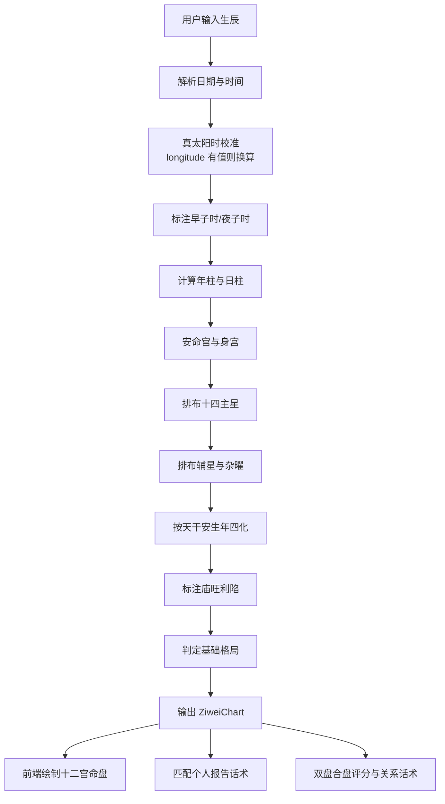

# 紫微斗数排盘逻辑与维护说明

本文档面向后续维护人员，说明当前 r7fortune.com 紫微斗数模块的数据结构、计算链路、话术映射和可调参数。

## 当前架构

当前版本没有把紫微规则拆成 MySQL 数据表，而是放在前端/共享逻辑文件中：

| 类型 | 文件 | 用途 |
|---|---|---|
| 基础参数表 | `src/lib/ziwei-doushu.ts` | 十二宫、天干地支、主星、辅星、四化、庙旺利陷 |
| 计算规则 | `src/lib/ziwei-doushu.ts` | 真太阳时、命身宫、主星、辅星、四化、格局、合盘评分 |
| 话术映射 | `src/lib/ziwei-report-templates.ts` | 个人报告、合盘报告模块文案 |
| 命盘展示 | `src/components/ZiweiDoushuPanel.tsx` | 4×4 紫微命盘图、复制参数、导出 PNG |
| 结果页 | `src/pages/DestinyDetail.tsx` | 免费命盘展示、付费入口、缓存报告数据 |
| 完整报告页 | `src/pages/DestinyFullReport.tsx`、`src/pages/SynastryFullReport.tsx` | 付费版报告展示 |

## 排盘全链路



## 核心数据结构

### ZiweiChart

`ZiweiChart` 是个人命盘的完整输出：

- `name`：用户名
- `birthLabel`：公历生日与原始出生时间
- `mingPalace`：命宫位置，如 `亥命宫`
- `shenPalace`：身宫位置，如 `酉福德`
- `elementBureau`：五行局
- `yearPillar`：年柱
- `dayPillar`：日柱
- `mainStar`：命宫主星
- `trueSolarTime`：校正后的真太阳时
- `timeTrace`：计算追踪说明
- `patterns`：基础格局标签
- `palaces`：十二宫数组
- `summary`：免费摘要

### ZiweiPalace

`ZiweiPalace` 是单个宫位：

- `name`：宫位名
- `branch`：地支
- `stem`：宫干
- `stars`：主星
- `assistants`：辅星
- `misc`：杂曜
- `four`：生年四化
- `brightness`：庙旺利陷
- `changsheng`：十二长生
- `focus`：宫位现实主题

### ZiweiSynastry

`ZiweiSynastry` 是双人合盘结果：

- `score`：综合评分
- `label`：关系标签
- `chemistry`：吸引力说明
- `risk`：风险提示
- `advice`：长期建议

## 可调参数位置

### 价格

文件：`src/lib/pricing.ts`

- 个人紫微完整版：`natal`
- 双人紫微合盘：`synastry`

### 付费弹窗文案

文件：`src/components/PayModal.tsx`

- `PAYWALL_CONFIGS.natal`
- `PAYWALL_CONFIGS.synastry`

### 报告话术

文件：`src/lib/ziwei-report-templates.ts`

- `buildZiweiNatalReport(chart)`
- `buildZiweiSynastryReport(chartA, chartB, synastry)`

### 规则表

文件：`src/lib/ziwei-doushu.ts`

- `FOUR_BY_STEM`：十天干四化
- `BRIGHTNESS_SEED`：庙旺利陷
- `MAIN_STARS`：十四主星
- `ASSISTANT_STARS`：辅星
- `MISC_STARS`：杂曜
- `PALACE_FOCUS`：十二宫现实主题

## 维护原则

1. 修改规则表后，必须运行：

```bash
npm test -- --run api/ziwei-doushu.spec.ts
```

2. 修改报告话术后，必须确认：

- 不出现绝对化敏感词
- 不用单星孤立断吉凶
- 每个模块至少引用一个真实字段
- 个人报告与合盘报告结论不互相矛盾

3. 修改排盘引擎后，必须运行：

```bash
npm run build
```

4. 如果后续迁移到 MySQL，建议拆成四类表：

- `ziwei_base_params`：天干、地支、宫位、星曜基础定义
- `ziwei_calc_rules`：四化、安星、庙旺利陷、格局条件
- `ziwei_report_templates`：报告模块与话术模板
- `ziwei_orders`：订单、报告权限、支付状态

## 后续专业版对齐方式

当前代码已经有自动测试框架。若要做到与文墨天机专业版逐项一致，需要新增 reference fixture：

```text
api/fixtures/ziwei-reference/
  sample-001.json
  sample-002.json
  ...
```

每个样本建议包含：

- 输入参数
- 命宫
- 身宫
- 十二宫主星
- 辅星/杂曜
- 四化
- 庙旺利陷
- 格局

之后新增快照测试，对差异项逐个修正规则表。
